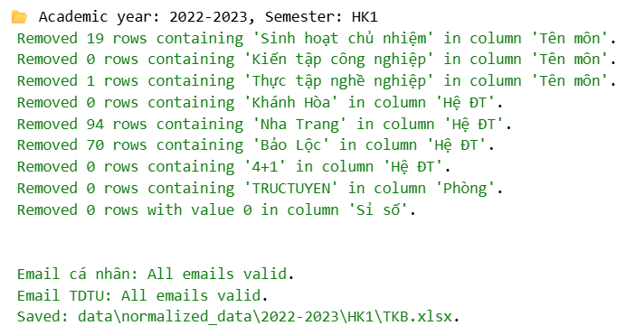
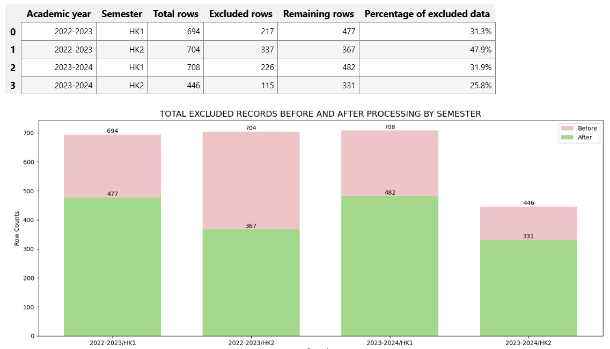
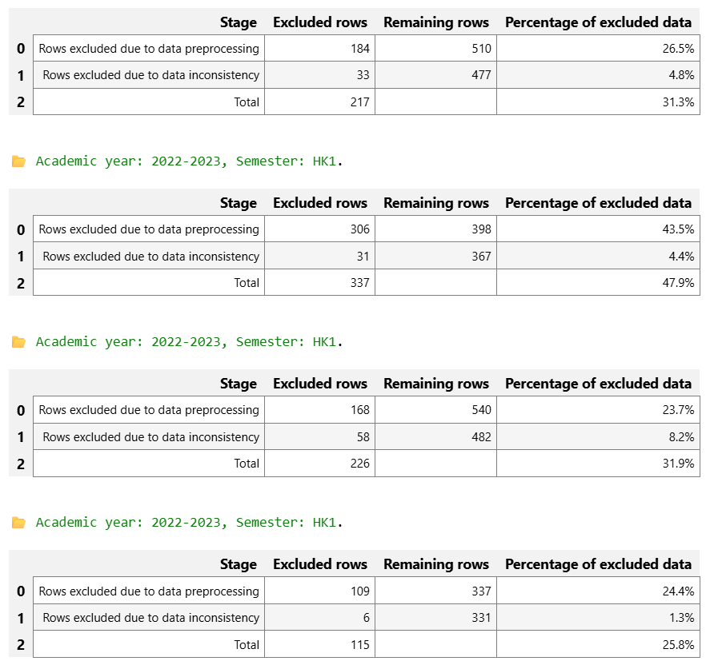
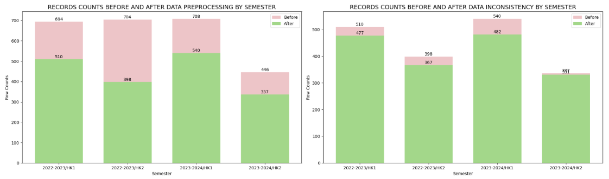
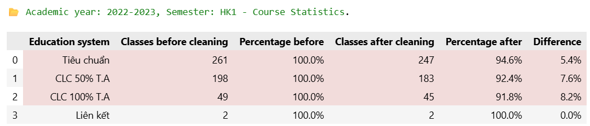
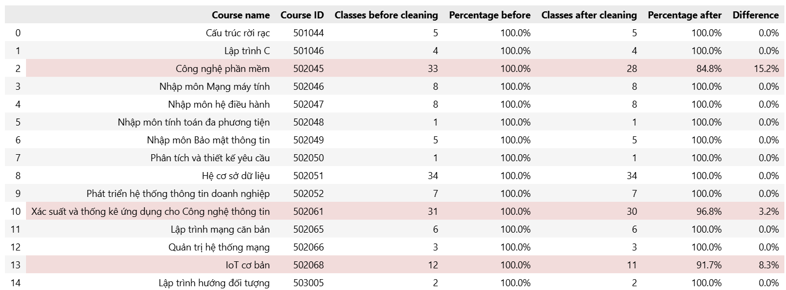

# 🧩 UCTP - University Course Timetabling Problem

UCTP - University Course Timetabling Problem là bài toán tối ưu tổ hợp, được xếp vào nhóm bài toán **NP-hard**, với mục tiêu xây dựng một thời khóa biểu cho các lớp học tại trường đại học bằng cách gán mỗi lớp học phần vào khung thời gian và phòng học phù hợp, sao cho thỏa mãn các ràng buộc cứng và tối ưu các ràng buộc mềm.

# 🎯 Khung dữ liệu huấn luyện cho UCTP

Khung dữ liệu huấn luyện (Training Data Framework) là một quy trình dùng để tổ chức, chuẩn hóa và biểu diễn dữ liệu từ bài toán thực tế thành dữ liệu có cấu trúc, nhằm phục vụ cho việc huấn luyện các mô hình học máy.

Trong trường hợp bài toán UCTP, Khung dữ liệu huấn luyện xác định:

- Các đơn vị dữ liệu / Các lớp học trong thời khóa biểu.
- Đặc trưng nào được dùng / Các thông tin về lớp học.
- Cách lưu trữ dữ liệu để mô hình có thể học được.

## Mô tả dữ liệu

Dữ liệu gốc được lưu trong một tệp bảng tính (.xlsx) gồm nhiều trang tính (sheets). Trang tính được sử dụng trong quá trình xử lý chứa các trường dữ liệu chính sau:

| STT | Trường dữ liệu   | Kiểu dữ liệu  | Mô tả                                                                                 | Ví dụ                  |
| --- | ---------------- | ------------- | ------------------------------------------------------------------------------------- | ---------------------- |
| 1   | Mã MH            | String        | Mã định danh của môn học                                                              | 503073                 |
| 2   | Nhóm             | Integer       | Các sinh viên đăng ký cùng một môn học sẽ được chia vào các nhóm                      | 3                      |
| 3   | Tổ               | Integer       | Một nhóm có thể được chia thành các tổ để phục vụ cho giờ học thực hành               | 0                      |
| 4   | Tên môn          | String        | Tên môn học                                                                           | Cơ sở dữ liệu          |
| 5   | Sỉ số            | Integer       | Số lượng sinh viên trong một nhóm hoặc tổ                                             | 45                     |
| 6   | Thứ              | Integer       | Thứ học trong tuần                                                                    | 2                      |
| 7   | Ca/Tiết          | String        | Ca học của một nhóm, tổ                                                               | 123-------------       |
| 8   | Phòng            | String        | Phòng học được phân công                                                              | C203                   |
| 9   | Giảng viên       | String        | Họ tên giảng viên phụ trách giảng dạy                                                 | Nguyễn Văn A           |
| 10  | Email cá nhân    | String / Null | Địa chỉ email cá nhân của giảng viên, sử dụng khi giảng viên chưa có email của trường | nguyenvana@gmail.com   |
| 11  | Email TDTU       | String / Null | Địa chỉ email thuộc hệ thống của Trường                                               | nguyenvana@tdtu.edu.vn |
| 12  | Hệ ĐT/Hệ đào tạo | String        | Hệ đào tạo của sinh viên                                                              | Tiêu chuẩn             |

Sau khi hoàn tất, dữ liệu được lưu dưới định dạng JSON. File JSON có cấu trúc là một mảng các đối tượng, trong đó mỗi đối tượng đại diện cho một nhóm hoặc một tổ. Đồng thời, tên các trường dữ liệu được chuyển sang tiếng Anh nhằm tránh các vấn đề liên quan đến dấu tiếng Việt và khoảng trắng.

```
[
    {
        "CourseID":"503073",
        "CourseName":"Cấu trúc rời rạc",
        "Group":3,
        "SubGroup":0,
        "DayOfWeek":2,
        "TimeSlot":"123-------------",
        "RoomID":"C203",
        "Capacity":45,
        "Lecturer":"Nguyễn Văn A",
        "PersonalEmail":"nguyenvana@gmail.com",
        "UniversityEmail":"nguyenvana@tdtu.edu.vn",
        "Program":"Tiêu chuẩn"
    }
]
```

Bảng ánh xạ tên trường dữ liệu như sau:

| STT | Tên trường (English) | Tên trường tương ứng (Tiếng Việt) |
| --- | -------------------- | --------------------------------- |
| 1   | CourseID             | Mã MH                             |
| 2   | CourseName           | Tên môn                           |
| 3   | Group                | Nhóm                              |
| 4   | SubGroup             | Tổ                                |
| 5   | DayOfWeek            | Thứ                               |
| 6   | TimeSlot             | Ca/Tiết                           |
| 7   | RoomID               | Phòng                             |
| 8   | Capacity             | Sỉ số                             |
| 9   | Lecturer             | Giảng viên                        |
| 10  | PersonalEmail        | Email cá nhân                     |
| 11  | UniversityEmail      | Email TDTU                        |
| 12  | Program              | Hệ ĐT/Hệ đào tạo                  |

## Mô tả các bước xử lý dữ liệu

#### 1. Tiền xử lý dữ liệu

- Sử dụng `pathlib` và `pandas` để dò tìm tệp dữ liệu nguồn, đọc cấu trúc và lựa chọn trang tính có tên chứa từ khóa "final".
- Chuẩn hóa các giá trị trong cột Điện thoại và Lớp về kiểu dữ liệu chuỗi.
- Không xét đến các dòng dữ liệu mà:
  - Cột 'Tên môn' chứa giá trị 'Sinh hoạt chủ nhiệm'
  - Cột 'Hệ đào tạo'/'Hệ ĐT' chứa các giá trị 'Khánh Hòa/'Nha Trang'/'Bảo Lộc'/'4+1'
  - Cột 'Phòng' chứa giá trị 'TRUCTUYEN'
- Kiểm tra mỗi dòng dữ liệu có ít nhất một trong hai thông tin liên hệ của giảng viên: Email cá nhân hoặc Email của Trường.

<p align="center">
  
</p>

#### 2. Xử lý dữ liệu mâu thuẫn

- Phát hiện các dòng dữ liệu mâu thuẫn với nhau:
  - Một giảng viên bất kỳ có dạy nhiều hơn một lớp tại một thời điểm hay không.
  - Một phòng học bất kỳ có được phân nhiều hơn một lớp tại một thời điểm hay không.
- Với mỗi tập chứa các dòng dữ liệu mâu thuẫn, I = {i_0, i_1,..., i_n}, việc lựa chọn dòng dữ liệu nào được giữ lại thực hiện theo các tiêu chí sau:
  - Nếu tồn tại dòng dữ liệu i_j sao cho việc giữ lại i_j đồng thời làm tối thiểu hóa:
    - tổng tỷ lệ dữ liệu mất mát theo môn học (của các dòng dữ liệu còn lại trong I), và 
    - tổng tỷ lệ dữ liệu mất mát theo hệ đào tạo (của các dòng dữ liệu còn lại trong I),  
thì ta giữ lại dòng dữ liệu i_j.

  - Trong các trường hợp còn lại, giữ lại dòng dữ liệu i_j sao cho tổng của hai tỷ lệ mất mát trên là nhỏ nhất.

#### 3. Các thao tác trực quan hóa dữ liệu

Trực quan hóa tổng số dòng dữ liệu bị loại trừ sau khi kết thúc 2 quá trình xử lý.

<p>
  
</p>

<br>
Trực quan hóa số dòng dữ liệu bị loại trừ tại mỗi bước xử lý.
<p>
  
</p>
<p>
  
</p>

<br>
Trực quan hóa chi tiết số dòng dữ liệu bị loại trừ tại bước xử lý thứ 2.
<p>
  
</p>
<p>
  
</p>

## Hướng dẫn chạy dự án

#### 1. Điều kiện

- [Git](https://git-scm.com/)
- [parquet-viewer]() - Extensions để trực quan file .parquet, nếu dùng [Visual Studio Code]()

#### 2. Sao chép kho lưu trữ

```bash
git clone https://github.com/Thanh-Binhhh/UCTP-Public.git
```

#### 3. Khởi động dự án

Tiến hành chạy file `main.ipynb`

## Hướng dẫn sửa lỗi (nếu có)

#### 1. Trường `Email cá nhân` và `Email TDTU` rỗng

Bản chất dữ liệu của cột `Email cá nhân` và `Email TDTU` trong file Excel không phải dữ liệu tĩnh, mà được sinh ra từ công thức Excel, ví dụ `=VLOOKUP(N2, Email!B:D, 2, 0)`. Điều này có nghĩa là giá trị email không được lưu trực tiếp trong ô mà chỉ được tính toán tại thời điểm Excel thực hiện recalculation.

Trong khi đó, thư viện `pandas` không thực thi công thức Excel, mà chỉ đọc giá trị đã được Excel tính sẵn và lưu trong file (cached value), vì vậy, khi thực thi mã chương trình dùng để đọc file, ta sẽ thấy dữ liệu trong 2 cột nêu trên rỗng.

Để đảm bảo dữ liệu được `pandas` đọc chính xác, cần mở file Excel và nhấn `Save` thủ công bằng Microsoft Excel trước khi xử lý.

## Cấu trúc dự án

```

├── EDA/
│   ├── data/
│   │   ├── raw_data                // Chứa dữ liệu gốc
│   │   |   ├── 2022-2023   
│   │   |   |   ├── HK1 
│   │   |   |   |   ├── DSSV.xlsx 
│   │   |   |   |   └── TKB.xlsx 
│   │   |   |   ├── HK2 
│   │   |   |   |   ├── DSSV.xlsx 
│   │   |   |   |   └── TKB.xlsx 
|   |   |   |   
│   │   |   ├── 2023-2024   
│   │   |   |   ├── HK1 
│   │   |   |   |   ├── DSSV.xlsx 
│   │   |   |   |   └── TKB.xlsx 
│   │   |   |   ├── HK2 
│   │   |   |   |   ├── DSSV.xlsx 
│   │   |   |   |   └── TKB.xlsx 
|   |   |   
│   │   └── training_ready_data     // Chứa dữ liệu sau khi đã hoàn thành xử lý, có thể đưa vào máy học.
│   ├── pipeline/                   // Chứa các file thư viện
│   │   ├── data_inconsistency.py   // Xử lý dữ liệu mâu thuẫn
│   │   ├── data_preprocessing.py   // Tiền xử lý dữ liệu
│   │   ├── data_visualization.py   // Trực quan dữ liệu
│   │   └── hepler_functions.py     // Các hàm bổ trợ
│   ├── main.ipynb                  // Entry point
│   └── README.md

```

# 📝 Tác giả

- **Thanh Bình** - [Github](https://github.com/Thanh-Binhhh) | [Github Student](https://github.com/Thanh-Binhh)
